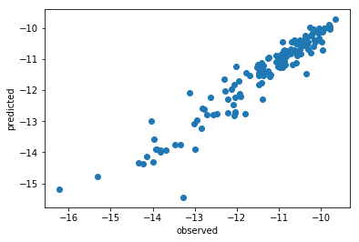
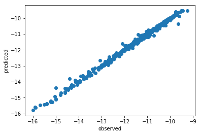
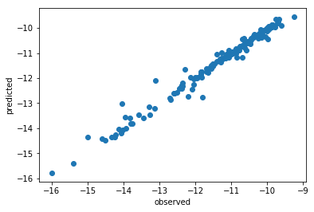

---
output:
  html_document: default
  pdf_document: default
  word_document: default
---


```python
import platform
print(platform.python_version())
```

    3.6.4
    


```python
import warnings
warnings.filterwarnings(action = 'once')
```

### Instantiate environment


```python
# import dataiku
# from dataiku import pandasutils as pdu

import pandas as pd
import numpy as np
import os
from rdkit import Chem
from rdkit.Chem import PandasTools
from rdkit.Chem import Descriptors
from rdkit.ML.Descriptors import MoleculeDescriptors
import sklearn
from sklearn import preprocessing
from sklearn.preprocessing import StandardScaler
from sklearn.feature_selection import VarianceThreshold
from sklearn.model_selection import train_test_split
from sklearn.model_selection import GridSearchCV
from sklearn.neighbors import KNeighborsRegressor
from sklearn.metrics import mean_squared_error
from sklearn.ensemble import RandomForestRegressor
import matplotlib.pyplot as plt 
import math

```

    C:\Users\us16120\Anaconda3\lib\importlib\_bootstrap.py:219: ImportWarning: can't resolve package from __spec__ or __package__, falling back on __name__ and __path__
      return f(*args, **kwds)
    C:\Users\us16120\Anaconda3\lib\importlib\_bootstrap.py:219: ImportWarning: can't resolve package from __spec__ or __package__, falling back on __name__ and __path__
      return f(*args, **kwds)
    C:\Users\us16120\Anaconda3\lib\site-packages\_pytest\fixtures.py:844: DeprecationWarning: The `convert` argument is deprecated in favor of `converter`.  It will be removed after 2019/01.
      params = attr.ib(convert=attr.converters.optional(tuple))
    

### Read data


```python
# folder_path = dataiku.Folder("data").get_path()
# train_df = PandasTools.LoadSDF(os.path.join(folder_path, "TR_AOH_516.sdf"))
# test_df = PandasTools.LoadSDF(os.path.join(folder_path, "TST_AOH_176.sdf"))

train_df = PandasTools.LoadSDF("data/TR_AOH_516.sdf")
test_df = PandasTools.LoadSDF("data/TST_AOH_176.sdf")
```


```python
train_df.head()
test_df.head()
```


<table border="1" class="dataframe">
  <thead>
    <tr style="text-align: right;">
      <th></th>
      <th>CAS</th>
      <th>Canonical_QSARr</th>
      <th>ChemID</th>
      <th>ID</th>
      <th>InChI Key_QSARr</th>
      <th>InChI_Code_QSARr</th>
      <th>LogOH</th>
      <th>MPID</th>
      <th>NAME</th>
      <th>OH</th>
      <th>OH Data Type</th>
      <th>OH Reference</th>
      <th>OH Temperature</th>
      <th>ROMol</th>
      <th>SMILES</th>
      <th>dsstox_substance_id</th>
      <th>iupac</th>
      <th>preferred_name</th>
      <th>source_casrn</th>
    </tr>
  </thead>
  <tbody>
    <tr>
      <th>0</th>
      <td>57-55-6</td>
      <td>CC(O)CO</td>
      <td>100004</td>
      <td>100004</td>
      <td>DNIAPMSPPWPWGF-UHFFFAOYSA-N</td>
      <td>InChI=1S/C3H8O2/c1-3(5)2-4/h3-5H,2H2,1H3</td>
      <td>-10.920818753952396</td>
      <td>98574</td>
      <td>1,2-PROPANEDIOL</td>
      <td>1.2E-11</td>
      <td>EXP</td>
      <td>ATKINSON,R (1989)</td>
      <td>25.0</td>
      <td></td>
      <td>CC(O)CO</td>
      <td>DTXSID0021206</td>
      <td>propane-1,2-diol</td>
      <td>1,2-Propylene glycol</td>
      <td>57-55-6</td>
    </tr>
    <tr>
      <th>1</th>
      <td>62-53-3</td>
      <td>Nc1ccccc1</td>
      <td>100008</td>
      <td>100008</td>
      <td>PAYRUJLWNCNPSJ-UHFFFAOYSA-N</td>
      <td>InChI=1S/C6H7N/c7-6-4-2-1-3-5-6/h1-5H,7H2</td>
      <td>-9.954677021213335</td>
      <td>98578</td>
      <td>ANILINE</td>
      <td>1.11E-10</td>
      <td>EXP</td>
      <td>KWOK,ESC & ATKINSON,R (1994)</td>
      <td>25.0</td>
      <td><img src="data:image/png;base64,iVBORw0KGgoAAAANSUhEUgAAAMgAAADICAIAAAAiOjnJAAAABmJLR0QA/wD/AP+gvaeTAAAPu0lEQVR4nO3de1QU5RsH8O+yXNRMkS6Q0c2Qsu0mltHisSQzES21m0ZqJZAKKiIGqMTRFPKWmJKlFqaWiZe8FBy1OqVERmYChilYYVChIAECwl7m98f8zqbm7A67887s7D6fwx8detj3Ab+7Ozvzvu9oOI4DIVLzULoB4pooWIQJChZhgoJFmKBgESYoWIQJChZhgoJFmKBgESYoWIQJChZhgoJFmKBgESYoWIQJChZhgoJFmKBgESYoWIQJChZhgoJFmKBgESYoWIQJChZhgoJFmKBgESYoWIQJChZhgoJFmKBgESYoWIQJChZhgoJFmKBgESYoWIQJChZhgoJFmKBgESYoWIQJChZhgoJFmKBgESYoWIQJChZhgoJFmKBgESYoWIQJChZhgoJFmKBgESYoWIQJT9lGMhgMBQUFOTk5so1on/Dw8KioKC8vL6UbUTeNbPeEHjduXGlpaXFxsTzD2U2n0/n4+BQVFWm1WqV7UTGZgnXo0CG9Xu/t7Z2RkXHttdfKMKJ9jEZjenp6VVXV6tWrJ02apHQ7asaxZzab+/fvD2Du3LkyDOegrVu3AvDz86utrVW6FxWTI1j8cdWNN97Y1NQkw3COe/zxxwEkJCQo3YiKMQ9WU1NTz549AWzcuJH1WFI5duyYp6enp6dnaWmp0r2oFfNgpaSkAAgNDTWbzazHkhB/gDV48GClG1ErtsE6depUp06dNBrN999/z3QgydXV1fn5+QH47LPPlO5FldgGa9SoUQAmTJjAdBRG3nrrLQBBQUEXLlxQuhf1YRisL7/8EkDXrl2rq6vZjcKOwWDQ6XQAli5dqnQv6sMqWEaj8d577wWQkZHBaAgZ7N+/H8DVV1/9119/Kd2LyrAK1qpVqwD06tWrtbWV0RDyiIyMBBATE6N0IyrDJFjnzp3jT6/v2LGDxePLqby83MfHx8PD44cfflC6FzVhEqxp06YBGDRokJWa1NTUvXv3shi9o0pKSmJiYgwGg1BBYmIigLCwMHWdMVGW9MEqKyvz8vLSarXFxcVCNQcOHNBoNF26dDlz5ozkDXSIyWS64447AKxcuVKopqGhISAgAMCWLVvk7E3VpA/W0KFDAUyZMkWowGQyPfDAAwDmzZsn+eh22LlzJ4AePXqcPXtWqOa9994DcNNNNzU3N8vZm3pJHKxdu3bZ/Edas2aNs/0jPfHEEwDi4uKECixPhvnz58vZmHpJGay2trbg4GAAK1asEKppbGx0wrcVy9t3SUmJUE1BQYFGo+ncuXNlZaWcvamUlMFavHgxgD59+rS3twvVzJw5E4Ber3e2A+H4+HgA4eHhVmqeffZZAFFRUbJ1pV6SBaumpqZ79+4A8vPzhWqc+aO75RTJp59+KlRz+vTpLl26aDSaAwcOyNmbGkkWrIkTJwIYMWKElRonP9m4cuVKmyd109LSAISEhJhMJjl7Ux1pgnXkyBEPDw9vb+8TJ04I1Tj/5RGj0XjPPfcAyMzMFKppaWm5+eabAeTk5MjYmvpIE6yBAwcCmDVrllCBwWC4++67nf+CruXC+Z9//ilUs2nTJgD+/v4NDQ1y9qYuEgRr8+bNAK6//vp//vlHqGb58uUAbr/9duefgvLUU08BePnll4UKzGbzgAEDAKSkpMjZmLo4GqyWlpZbbrkFwLp164Rq6urqrrnmGgB79uxxcDgZnDp1iv+EYWVy4o8//si/9Z88eVLO3lTE0WClp6cD6Nu3r9FoFKpR3TTf5ORkAA8//LCVcyIvvfQSgJEjR8rZmIo4FKw//vjjqquuAvDNN98I1ahxYUJjY+MNN9wAYNOmTUI1f//9d7du3QA4yaV0Z+NQsMaMGQNgzJgxVmr4pVTTp093ZCD5ffDBB/yStfPnzwvVZGZmArjrrruszIxwW/YH69tvv+Uvcfz+++9CNdu2bVPp4k+TycQvsk1LSxOqaWtr6927N4BVq1bJ2Zsq2Bksk8n04IMPAkhPTxequXDhQlBQEIB33nnHzu4UVVhYyD9zfvvtN6GaHTt28BfdVffMYc3OYK1btw5AYGCglXeKhQsXAtDpdOp9p3jhhRcAPPfcc1ZqhgwZAmDq1KmydaUK9gTLcmz78ccfC9VYjm337dvnQHsKq6qq4j+dfP3110I1P//8s6enp/WZEW7InmDNmjXL5qfx8ePHAxg9erQDvTmFefPmAbj//vutnE+ZMmUKgMcee0zOxpxch4NVUVHBnz8sKioSqjl8+LDLnD9saWm59dZbAaxZs0aoxnIGeNeuXXL25sw6HKwRI0YAmDhxolCB2WwOCwsDMHv2bMd6cxZbtmzhr1nV19cL1axYsUIt16zk0bFgffHFF/wMBSvXaDds2OB612gfeeQRADNnzhQqMBgM/MyIRYsWydmY0+pAsMT87Zqbm/lZJR9++KEU7TmLn376SavVenl5/fLLL0I1Yp517qMDwRLzaj9nzhwA/fr1c715cDExMQAiIyOt1Ng8TnAfYoMl5vi0srKSn7l78OBBidpzIjU1Nb6+vgDy8vKEasR8snETYoMl5hP1008/DWDcuHFSNOaMli5dCuDOO++0slpEzLkYdyAqWPw5QE9PTyvnAA8ePMgvbnbh1VHt7e38sunly5cL1Yg5e+wORAXL5lULo9F43333AViwYIF0vTmjPXv2APD19bWyOYCY610uz3awxFxnXb16tbMtbmYnIiICwKRJk4QKxFyhd3k2giVmZkh9ff11110HYOvWrVK354yOHz/OL5s+evSoUI2YOUWuzUawMjIybM5lS0hIADBgwAD3OVwV8yuLmQUpD72eA7jy8ku+GRvL6fX/Flj+++Kf+u83xbMWLDGzb/mnr4eHx+HDh+3vQm0sL9Lbtm0TqhEzb1sefLBiYy/5JutgWbutXEpKSmNj48iRI/mD9yvKz883Go3R0dH9+vWz8lAuxtfXd/78+QD4Y/krCgwMTEpKApCQkGA2m+Vr7kpiY7FmDSoqZBxSKHHiVzh99913iu+fJj+j0fj5559brxGzNk4Gej0XG8tlZV3yCqTYKxb/V4uLi+MP3q0IDQ3l3xfcilarHTZsmPWazp078wep8fHxGnsNHPiORgP7vi5+p5k+HYWFyM9n+lf5F91h1Y3k5WHBgiv/r8LCy0NZWOjQWILBioyM1Gg02dnZJ0+edGgEN9ba2jp79mwA2dnZdr+nHDgwheNg39e+fZf0ExEBACtWXKFVvf7yn9XrHfrdBYMVEhIyYcKE9vb21157zaER3NiiRYsqKyv79u3LL5t2BnPnIiFBjoGsvRVmZmZ269Zt165de/fulaMX11JVVcVftM7KyvLwcJZDjogIxMZe+UVLWtZ+YX9//9TUVACJiYkGg4F5L64lKSmpubl57Nix/B5PzmPWLCQk4NixDvxIRcW/x14iD/9tPJMSExN79+5dVlbG70dNRCosLMzNze3cuTO/DN+pBAUhNrZjx+a9eyMvDxyHvDwMGybqfJiNYHl7e/Nb1r7++uu1tbUd6MWNmc1mfq+K5ORk/jyWs+nQq0R+PvT6/x/4R0RAr0d5uYgfE/PBhN8GPT4+3u6PNm5l7dq1cN1pMwAnPIX2ojIxj0WLfcWzTPTbvHmz0r1I77LT91aInZocFxcHW9ugE47j+OuDTriRveOysjhx73AcJz5Y586d4xdT7Ny5086+3IALL6bgU3XZ3BsrOrD86+233wbQq1cvWuwrZPjw4QCio6OVbkRiHXqt4nWg3LIN+ptvvtmxQdyDqy5YLS/v2GsVr2M55LdBd72/neMsG9kvXrxY6V4kFhvLAZd8Sfap8GJPPvkkgFdeecWeHl1XVlYWaFOQi9i/jZGVbdDdjWWZ+O7du5XuxVnYs/EaP9+BFvtaTJ48GbTx2qUc2iryo48+krwh1bEsE1fRRvYysHNz2/fffx+2tkF3E/xKk2nTpindiHNhuB23O9i+fTvUuZE9a/bfQEDMNuiuzbJM3JGZx67KoVuejB07FsDzzz8vVTfqImaZuNuS5iZNVrZBd1V0kybrHJqLHRgYyO8zlpCQYDKZHHko1UlOTm5sbBw1apSVZeJuzcFgWrZBX7t2rSRJVwVX2sieEQlu3fvJJ5/A1q17XYnl1r2pqalK9+K8pLzZeFJSkiSP5uQ2btwIl9vIXnLSBOvIkSNardbb29vKNuiuwbKR/fr165XuxalJEyyO46KjowEMHz5cqgd0TnPnzgUQEhLiehvZS0uyYNXU1HTv3h1Afn6+VI/pbE6fPu3CG9lLS7JgcRy3ZMkSAH369LGyDbqqPfPMMwBefPFFpRtRASmD1dbWFhwcDCArK0vCh3USBQUFLr+RvYSkDBbHcbt37wbQo0ePs2fPSvvIyjKZTPxemG+88YbSvaiDxMHiOG7o0KEAJk+eLPkjK+jdd9+F22xkLwnpg1VWVmZzG3R1aWhoCAgIAJCbm6t0L6ohfbA4jps+fTqAQYMGsXhw+c2YMQNAWFgYTcUWT8NxnOTXH+vr64ODg2tra7dv3z569Gib9dXV1VOnTpW8DesSExP5KzPWVVRU6HQ6o9FYVFTkVluOO4pRYLOzswHcdtttra2tNouPHz8u/y8u8u5c/NbIsZdtv09sYfKKBcBkMoWEhJSUlCxcuJDf4NWK8+fP77tsH1b2+vfvHxgYaL1m//79Q4YM6dat24kTJ/jDLCIWu8x+9dVXALp27VpdXc1uFHYMBoNOpwOwbNkypXtRH4bB4jiOP8AaP34801EYWbZsGYCgoCBa3GwHtsH69ddfO3XqpNFoDh06xHQgyZ05c4a/A7TN+5qQK2IbLI7j+H2XQ0ND1fVZ/dVXXwUwePBgpRtRK+bBampq6tmzJ4ANGzawHksqR48e1Wq1np6ex44dU7oXtWIeLI7j1q9fDyAgIEAtUy4fffRRADNmzFC6ERWTI1hms/mhhx4CMGfOHBmGc1Bubi4APz+/uro6pXtRMU8ZzmhoNJqsrCy9Xr9kyZLu3bv7+/vLMKh9DAZDWloagIyMDD8/P6XbUTFWJ0j/a9y4caWlpcXFxfIMZzedTufj41NUVKTVapXuRcXkC5bBYCgoKMjJyZFnOLuFh4dHRUV5eXkp3Yi6yRcs4lac5XZnxMVQsAgTFCzCBAWLMEHBIkxQsAgTFCzCBAWLMEHBIkxQsAgTFCzCBAWLMEHBIkxQsAgTFCzCBAWLMEHBIkxQsAgTFCzCBAWLMEHBIkxQsAgTFCzCBAWLMEHBIkxQsAgTFCzCBAWLMEHBIkxQsAgTFCzCBAWLMEHBIkxQsAgTFCzCBAWLMEHBIkxQsAgTFCzCBAWLMEHBIkxQsAgTFCzCBAWLMEHBIkxQsAgTFCzCBAWLMEHBIkxQsAgT/wNcf5siDcVnOwAAAABJRU5ErkJggg==" alt="Mol"/></td>
      <td>Nc1ccccc1</td>
      <td>DTXSID8020090</td>
      <td>aniline</td>
      <td>Aniline</td>
      <td>62-53-3</td>
    </tr>
    <tr>
      <th>2</th>
      <td>64-19-7</td>
      <td>CC(O)=O</td>
      <td>100012</td>
      <td>100012</td>
      <td>QTBSBXVTEAMEQO-UHFFFAOYSA-N</td>
      <td>InChI=1S/C2H4O2/c1-2(3)4/h1H3,(H,3,4)</td>
      <td>-12.130768280269036</td>
      <td>98582</td>
      <td>ACETIC ACID</td>
      <td>7.399999999999999E-13</td>
      <td>EXP</td>
      <td>ATKINSON,R (1989)</td>
      <td>25.0</td>
      <td><img src="data:image/png;base64,iVBORw0KGgoAAAANSUhEUgAAAMgAAADICAIAAAAiOjnJAAAABmJLR0QA/wD/AP+gvaeTAAAR7klEQVR4nO3de1RVdfrH8fdBvKY4YolFmiYcQMIbqQV0s6SGSscb5SUN06h0PIgokPeJUavRUFeNl2W1TLvYSl21lMpKMxWjIc0RiEtq3vECzBG5CZzfH4cfjQ6Z7LPP2Xsfntfij4Sznv2s5afnu9nu794mm82GEGrz0LoB4Z4kWMIpJFjCKSRYwikUBSstDZPpt6+0tKt++r/fsX9eNCWND1ZsLFFR2Gy/fUVFER7uhN6EgTUyWMuXc/gw11yhsP9x+XLVmhLG18hgbdrEnDkNfH/OHOLiVGlIuIfGBKuggH378Pdv4Ef2bxYUqNOUMD5Pdcr4+QHk59f9R1SUOmWFYal6uaF+mG3fftXZ/fbtah5FGEFjguXnR1gY+fkN/Mh+fcE+roRo9MSKjm54mUtJITVVlYaEe2jkOZbFQnY2JtNVVxxMJsLCsFjU7UwYWuPPsVavZvv2q668b9/O3r1XfWbfPhlgTZxJ/fuxsrMJCaF5c7Ky6NFD5eLCIJzwj9A9ezJ+PJWVJCSoX1wYhBMmFlBYiNmM1crnn/Poo+rXF7rnnNtmfHxITgaIj+fKFaccQuib0+7Hio/H35/sbFavdtYhhI45Zym027qVYcPo0IH8fDp2dNZRhC458w7Sv/yFyEiKi1m40IlHEbrkzIkFZGfTuzc2GwcOEBLixAMJnXHyPe89exIbS02N3K3V1Dh5YgHFxfj7c/EiW7cydKhzjyV0w/m7dDp0YP58gPh4KiudfjihDy7Z/vXSS4SEcOSI3BffdDh/KbT75hsefph27cjN5dZbXXFEoSlXbVgdNIghQ7h0qeG9GMLtuGpiAb/8QnAwV66Qns6AAS46qNCIC7fY9+iBxUJtLXFx1+5MFG7HhRMLuHSJgADOnOH99xk92nXHFS7n2oeCtGtHSgrArFlcvuzSQwvXcvnTZp59lv79OXmS11939aGFC7l2KbRLTyc8nFatyM6mWzdXH124hBbPx7r3Xp5+mvJykpI0OLpwCS0mFnDyJIGBXL7Mrl088IAGDQgn0+iJfrffzsyZAHFx1NRo04NwJo0mFlBeTlAQv/7K2rVMmqRND8JptAsW8OGHjB5Np07k5dG+vWZtCCfQ9OG2Tz/N/fdz7lzdxS3hRjSdWMCBA/TvT7NmHDpEQICWnQhVaf047r59iYmhqkq2TbsZrScWcO4cZjP/+Q9paTz2mMbNCJVoPbGATp3qbtKSbdNuRAfBAqZNw2wmJ4e33tK6FaEOHSyFdp99xpAhdOhAXh4336x1N8JR+phYwJNP8thjFBczb57WrQgV6GZiATk59O5NbS0//kivXlp3Ixyim4kFBAXx4ouybdo96GliAcXFmM1cuMAnnzB8uNbdCOX0NLGADh3qHk2TkEBFhdbdCOV0FiwgNpZevTh6lGXLtG5FKKezpdBu504GDaJtW3Jzue02rbsRSuhvYgEPPcTw4ZSW1j3IVBiQLicWcPQoPXtSWUl6OgMHat2NaDRdTiyge3emT7e1bZv21ls6jb64Lr0GC3j55cF33BG1fv2GDRu0bkU0mo6D1bbtMwkJQHJycmlpqdbdiMbRcbBg/PjxAwcOPHXq1JIlS7TuRTSOXk/e/9/+/fvDwsJatGhx+PBhP3nRpnHoemIB99xzz9ixYysrK5Pl0oOh6H1iAadOnQoMDCwtLf3yyy8HDx6sdTvihuh9YgG+vr6JiYnA9OnTq6urtW5H3BADTCygoqIiKCjo2LFjq1atio2N1bod8ceMESzg448/jo6O9vb2zs/P9/b21rod8QcMsBTajRo16sEHHywqKkqRbdNGYJiJBfz000+hoaEmk+ngwYPBwcFatyOuxzATC+jdu/ekSZOqq6vj5N5l3TPSxALOnz9vNptLSkq2bdsWFRWldTvidxlpYgG33HLL3LlzAYvFUimvfNIxgwULmDZtWnBwcEFBwZtvvql1L+J3GWwptNuxY0dkZKSXl1dubm7nzp21bkc0wHgTCxg8eHBUVJTVap1vfxOi0B9DTiygoKAgODi4uro6IyMjNDRU63bEtQw5sQA/P78pU6bU1tZaLBaD/r/h3ow6sQCr1RoQEHD27NlNmzaNGjVK63bEVYw6sQAvL68FCxYAM2bMKCsr07odcRUDBwuYPHlyaGjoiRMnlsm2aZ0x8FJot2fPnvvvv79169Y5OTldu3bVuh1Rx9gTC4iIiBgxYkRZWdns2bO17kX8xvATCzhx4kRgYGB5efnu3bsjIiK0bkeAG0wsoEuXLvHx8TabzWKx1NbWat2OAPeYWEBZWVlQUNDx48fffffdCRMmaN2OcJdgAe+999748eN9fHzy8vK8vLy0bqepc4el0G7cuHERERGFhYWybVoP3GdiAZmZmQMGDPD09Dx8+LC/v7/W7TRp7jOxgNDQ0HHjxlVVVSXJ26a15lYTCygsLDSbzVar9YsvvoiMjNS6nabLrSYW4OPjI9um9cDdggUkJCT4+/tnZ2evWbNG616aLndbCu02b948YsQIb2/vvLy8jh07at1OU+SGEwsYPnz44MGDi4qKXnnlFa17aaLcZ2IdOXKkffv29fMpKyurT58+wIEDB+666y5NW2uK3GdixcTEmM3m7777zv7H4ODgyZMny7Zpzdjcwocffgh06tSpuLi4/psXL160D7BPP/1Uw96aJncIVllZWbdu3YA1a9Zc86PU1FSgR48eFRUVmvTWZLlDsBYuXAj06dOnurr6mh9duXLFfoL1+uuva9Jbk2X4YJ08efKmm24Cdu3a1eAH0tLSAPtnhAL5+fkK/l4MH6wxY8YA0dHR1/lMWlpaUFCQ1n9BRqUsWMa+3JCenh4eHt6qVavs7Gz7aZbQCQNfbqitrY2Li7PZbDNnzpRU6Y2BJ9Y777wzceJEX1/f3NxcOYXSG6MG69KlSwEBAWfOnNm4caP9NEuBAwcO2Gy2fv36qdubAMNeILXfG3PvvffW1tYqq1BTU3P33Xd7eHhs2bJF3d6EzaC/Ff7yyy8tW7b08PD4/vvvFRdZt24d4OvrW1paqmJvws6QwRo6dCgQExOjuILVar311luBjRs3qtiYqGe8YH399ddAu3btTp8+rbjIrFmzHFxJxfUZLFjV1dUhISHAkiVLFBcpKChwfCUV12ewYK1cuRK48847y8vLFRcZMmQIMHHiRBUbE9cwUrCKiopuvvlmwJHf41RZScUfMlKwpk6dCgwaNEhxBVVWUnEjDBOs7Ozs5s2bN2vW7NChQ4qLrFixwr6Syu1ZzmaYYD366KPAlClTFFcoKiqy31C6detWFRsTDTJGsLZu3Qp06NDh/PnziotMmTLFwZVU3DgDBKuystJsNgMrVqxQXCQrK8vxlVTcOAME69VXXwWCgoKqqqoUF7GvpFOnTlWxMXEdeg9WYWFh+/btgc8//1xxkS1btji+kopG0XuwJk6cCAwZMkRxhcrKSvuzslauXKliY+L6dB2sH3/80cPDo0WLFrm5uYqLLF68GOjZs6cjK6loLP0Gq7a29r777gNmzZqluMjZs2ftzyN1ZCUVCug3WO+//z7QqVOnkpISxUViYmKAoUOHqtiYuBE6DVZZWdkdd9wBrFu3TnGRzMxMx1dSoYxOg2V/dWrfvn1ramqUVahfSRMTE9XtTdwIPQbrxIkT9l033377reIiGzZsAHx8fBxZSYViegzWU089BYwePVpxhbKyMvubwN5++20VGxM3TnfB2rt3r8lkat269bFjxxQXmTt3LtCvXz/FK6lwkL6CVVNT079/f2D+/PmKixw/frxNmzYmk2n37t3qtSYaR1/BWrt2LXD77bc7siUrOjoaGDNmjIqNicbSUbDqt2R98MEHiovs2bPH8ZVUOE5HwUpISADCwsIc3NwMLFy4UN3eRGPpJVj1W7IyMjIUF7G/MaBLly6XL19WsTehgF6C9eSTTwLPPfec4gpWq7Vz587ARx99pGJjQhldBOurr75yfEvWjBkzHFxJhYq0D1b982dfe+01xUXy8/PtK+kPP/ygYm9CMe2DtXn1asDPz8+RLVmPP/44MHnyZBUbE47QOlgXLtg6dvw1LGzHZ58prrFjxw77SnrmzBkVWxOO8FT1KW6NN28eFy92bd266xNPKCtQ/1KT+fPn20/ehS5omeqsLJunp83T0+bAlqw33ngDefeE/mgarMhIG9imTVNcoP5tOZ85sJIKZ9AuWJs328Dm7W27cEFxjRdeeAF45JFHVOxLqEKjpyZXVXHXXeTn8+abvPSSshryRkI90+gFAkuXkp9Pz548/7ziGvbXiU+dOlVSpUNaTKzCQsxmrFa++ILISGU1Pvnkk5EjR8pbn3VLi4mVmIjVyrBhilNVWVmZlJQEpKSkSKp0ytUndZmZNg8PW4sWtrw8xTX2rlzZytMzJCTkf19QKHTCtRdIbTYsFmpriY/H319hkdOnw5KTi7t3z1m5slmzZqr2J1Tj2qVw40b27MHHh+Rk5UWSkigtbdWrV98HHlCvM6EyF568l5URFMTx47zzDs8+q7BIZiYDBuDpSVYWfn5qtidU5cKJtXgxx4/Trx/jxyusUL+SJiRIqnTOVRPrxAkCAykvZ/duIiIUFlm/ngkT8PEhLw8vL1X7Eypz1cSKj6esjLFjlaeqtLTuzOy11yRV+ueSibV3L/fdR6tW/PwzXbsqLDJ7NosWERpKRgYeBn7jcBPh/L+h2losFmw2kpOVp+roUZYtw2QiNVVSZQjO/0tau5bMTLp0YcYM5UVmzqSignHjlK+kwrWcvBRarQQEcPYsmzYxapTCIjt3MmgQbdqQk6N85gnXcvLEWrCAs2cJD2fkSIUVamqYPh3g5ZclVQbizIlVUEBwMNXVZGQQGqqwyKpVvPgiXbuSk0ObNqr2J5zImRPLYqGqikmTlKeqpIR58wCWLZNUGYvTJtaOHURG4uVFbi6KN89Mn05qKhER7N6NyaRqf8K5nBOs6mr69CEri6VLiY9XWOTnn+nVi5oah1ZSoRHnLIUrVtT9I/GUKcqLxMdz5QrPPy+pMiInTKzz5zGbKSlh2zaiohQW2baNJ57Ay4u8PHx8VO1PuIITJtbcuZSU8MgjylN15Urd1dQFCyRVBqX2xPrpJ0JDMZk4eJDgYIVFli4lIYHAQA4donlzNdsTrqL2xIqLo6aGv/5VearOnSMlBWDZMkmVcakarI8/ZtcuvL2ZM0d5kTlzKCnh8cf585/V60y4mnpLYUUFQUEcO8aqVcTGKixy8CB3342HB//+NwEB6jQmtKDexPrHPzh2jOBgnntOeZH6lVRSZXAqTaxTpwgMpLSUnTt58EGFRTZt4qmnuOUW8vL4059U6EpoR6WJlZREaSkjRypPVXk5iYkAKSmSKjegxsTav5+wMFq2JDub7t0VFnnlFebNo08f/vUvZBuq8Tk8sexbsmw2EhKUp+rUKV59FSA1VVLlHhwO1vr1ZGTg61u3kCmTmMjly4wahWxudheOLYWlpQQEcPo0773HuHEKi6SnEx5Oy5bk5NCtm/JmhJ44NrEWLeL0ae65h7FjFVaw2YiLw2Zj5kxJlTtxYGIdOUJwMJWVpKczcKDCIu++S0wMvr7k5nLTTQqLCP1xYGIlJVFRwTPPKE9VaSmzZwMsWSKpcjMOPB/r73/HZGLxYocqOLiSCr3S6KnJ/NdKun8/AwZo04NwGu22q8+YQUUFEyZIqtySRhPrm294+GHatiU3l9tu06AB4WRaTKz/3twsqXJTWgRr1SoOHeLOO+viJdyRy5fC4mLMZi5cYPNmhg1z6aGFC7l8Yi1YwIULPPSQpMq9qRGstDRMpt++0tJ+95M5OfzznzRrRmqqCscVOuZwsGJjiYrCZvvtKyqK8PCGP7xoUd3m5l69HD2u0DfHgrV8OYcPc81Zmv2Py5c38PlVq1i4kL/9zaGDCiNw7OQ9PJw5cxrYp5WWVjfGRFPlwMQqKGDfvoZfiWP/ZkGB8uLC4JzzW6H9tRH5+U4pLozAmZcbFL/fSxifA8Hy8yMsrOGxZL/iIK+7acIcm1jR0Q0/qyglRa5UNXGOvQjTYiE7G5Ppql8ATSbCwrBYHOxMGJoa/1Zov7hQb/t2eVCM0O4OUuHW5IVHwin+D4cNHdzHpxkrAAAAAElFTkSuQmCC" alt="Mol"/></td>
      <td>CC(O)=O</td>
      <td>DTXSID5024394</td>
      <td>acetic acid</td>
      <td>Acetic acid</td>
      <td>64-19-7</td>
    </tr>
    <tr>
      <th>3</th>
      <td>67-63-0</td>
      <td>CC(C)O</td>
      <td>100016</td>
      <td>100016</td>
      <td>KFZMGEQAYNKOFK-UHFFFAOYSA-N</td>
      <td>InChI=1S/C3H8O/c1-3(2)4/h3-4H,1-2H3</td>
      <td>-11.294992040666681</td>
      <td>98586</td>
      <td>ISOPROPANOL</td>
      <td>5.07E-12</td>
      <td>EXP</td>
      <td>KWOK,ESC & ATKINSON,R (1994)</td>
      <td>25.0</td>
      <td></td>
      <td>CC(C)O</td>
      <td>DTXSID7020762</td>
      <td>propan-2-ol</td>
      <td>Isopropanol</td>
      <td>67-63-0</td>
    </tr>
    <tr>
      <th>4</th>
      <td>71-23-8</td>
      <td>CCCO</td>
      <td>100020</td>
      <td>100020</td>
      <td>BDERNNFJNOPAEC-UHFFFAOYSA-N</td>
      <td>InChI=1S/C3H8O/c1-2-3-4/h4H,2-3H2,1H3</td>
      <td>-11.257274868695298</td>
      <td>98590</td>
      <td>1-PROPANOL</td>
      <td>5.530000000000001E-12</td>
      <td>EXP</td>
      <td>KWOK,ESC & ATKINSON,R (1994)</td>
      <td>25.0</td>
      <td></td>
      <td>CCCO</td>
      <td>DTXSID2021739</td>
      <td>propan-1-ol</td>
      <td>1-Propanol</td>
      <td>71-23-8</td>
    </tr>
  </tbody>
</table>


### Concatenate data


```python
AOH = pd.concat([train_df[["Canonical_QSARr", "LogOH"]],
                 test_df[["Canonical_QSARr", "LogOH"]]], ignore_index = True)
AOH['LogOH'] = pd.to_numeric(AOH['LogOH'])
```


```python
AOH.head()
```


<table border="1" class="dataframe">
  <thead>
    <tr style="text-align: right;">
      <th></th>
      <th>Canonical_QSARr</th>
      <th>LogOH</th>
    </tr>
  </thead>
  <tbody>
    <tr>
      <th>0</th>
      <td>C=O</td>
      <td>-11.028260</td>
    </tr>
    <tr>
      <th>1</th>
      <td>ClC(Cl)(Cl)Cl</td>
      <td>-15.920819</td>
    </tr>
    <tr>
      <th>2</th>
      <td>ClC1C(Cl)C(Cl)C(Cl)C(Cl)C1Cl</td>
      <td>-12.782516</td>
    </tr>
    <tr>
      <th>3</th>
      <td>CCOCC</td>
      <td>-10.882729</td>
    </tr>
    <tr>
      <th>4</th>
      <td>CNN</td>
      <td>-10.187087</td>
    </tr>
  </tbody>
</table>


### Calculate Features


```python
nms = [x[0] for x in Descriptors._descList]
calc = MoleculeDescriptors.MolecularDescriptorCalculator(nms)
for i in range(len(AOH)):
    descrs = calc.CalcDescriptors(Chem.MolFromSmiles(AOH.iloc[i, 0]))
    for x in range(len(descrs)):
        AOH.at[i, str(nms[x])] = descrs[x]
AOH = AOH.dropna()
```


```python
AOH.head()
```


<table border="1" class="dataframe">
  <thead>
    <tr style="text-align: right;">
      <th></th>
      <th>Canonical_QSARr</th>
      <th>LogOH</th>
      <th>MaxEStateIndex</th>
      <th>MinEStateIndex</th>
      <th>MaxAbsEStateIndex</th>
      <th>MinAbsEStateIndex</th>
      <th>qed</th>
      <th>MolWt</th>
      <th>HeavyAtomMolWt</th>
      <th>ExactMolWt</th>
      <th>NumValenceElectrons</th>
      <th>NumRadicalElectrons</th>
      <th>MaxPartialCharge</th>
      <th>MinPartialCharge</th>
      <th>MaxAbsPartialCharge</th>
      <th>MinAbsPartialCharge</th>
      <th>FpDensityMorgan1</th>
      <th>FpDensityMorgan2</th>
      <th>FpDensityMorgan3</th>
      <th>BalabanJ</th>
      <th>BertzCT</th>
      <th>Chi0</th>
      <th>Chi0n</th>
      <th>Chi0v</th>
      <th>Chi1</th>
      <th>Chi1n</th>
      <th>Chi1v</th>
      <th>Chi2n</th>
      <th>Chi2v</th>
      <th>Chi3n</th>
      <th>Chi3v</th>
      <th>Chi4n</th>
      <th>Chi4v</th>
      <th>HallKierAlpha</th>
      <th>Ipc</th>
      <th>Kappa1</th>
      <th>Kappa2</th>
      <th>Kappa3</th>
      <th>LabuteASA</th>
      <th>PEOE_VSA1</th>
      <th>PEOE_VSA10</th>
      <th>PEOE_VSA11</th>
      <th>PEOE_VSA12</th>
      <th>PEOE_VSA13</th>
      <th>PEOE_VSA14</th>
      <th>PEOE_VSA2</th>
      <th>PEOE_VSA3</th>
      <th>PEOE_VSA4</th>
      <th>PEOE_VSA5</th>
      <th>PEOE_VSA6</th>
      <th>PEOE_VSA7</th>
      <th>PEOE_VSA8</th>
      <th>PEOE_VSA9</th>
      <th>SMR_VSA1</th>
      <th>SMR_VSA10</th>
      <th>SMR_VSA2</th>
      <th>SMR_VSA3</th>
      <th>SMR_VSA4</th>
      <th>SMR_VSA5</th>
      <th>SMR_VSA6</th>
      <th>SMR_VSA7</th>
      <th>SMR_VSA8</th>
      <th>SMR_VSA9</th>
      <th>SlogP_VSA1</th>
      <th>SlogP_VSA10</th>
      <th>SlogP_VSA11</th>
      <th>SlogP_VSA12</th>
      <th>SlogP_VSA2</th>
      <th>SlogP_VSA3</th>
      <th>SlogP_VSA4</th>
      <th>SlogP_VSA5</th>
      <th>SlogP_VSA6</th>
      <th>SlogP_VSA7</th>
      <th>SlogP_VSA8</th>
      <th>SlogP_VSA9</th>
      <th>TPSA</th>
      <th>EState_VSA1</th>
      <th>EState_VSA10</th>
      <th>EState_VSA11</th>
      <th>EState_VSA2</th>
      <th>EState_VSA3</th>
      <th>EState_VSA4</th>
      <th>EState_VSA5</th>
      <th>EState_VSA6</th>
      <th>EState_VSA7</th>
      <th>EState_VSA8</th>
      <th>EState_VSA9</th>
      <th>VSA_EState1</th>
      <th>VSA_EState10</th>
      <th>VSA_EState2</th>
      <th>VSA_EState3</th>
      <th>VSA_EState4</th>
      <th>VSA_EState5</th>
      <th>VSA_EState6</th>
      <th>VSA_EState7</th>
      <th>VSA_EState8</th>
      <th>VSA_EState9</th>
      <th>FractionCSP3</th>
      <th>HeavyAtomCount</th>
      <th>NHOHCount</th>
      <th>NOCount</th>
      <th>NumAliphaticCarbocycles</th>
      <th>NumAliphaticHeterocycles</th>
      <th>NumAliphaticRings</th>
      <th>NumAromaticCarbocycles</th>
      <th>NumAromaticHeterocycles</th>
      <th>NumAromaticRings</th>
      <th>NumHAcceptors</th>
      <th>NumHDonors</th>
      <th>NumHeteroatoms</th>
      <th>NumRotatableBonds</th>
      <th>NumSaturatedCarbocycles</th>
      <th>NumSaturatedHeterocycles</th>
      <th>NumSaturatedRings</th>
      <th>RingCount</th>
      <th>MolLogP</th>
      <th>MolMR</th>
      <th>fr_Al_COO</th>
      <th>fr_Al_OH</th>
      <th>fr_Al_OH_noTert</th>
      <th>fr_ArN</th>
      <th>fr_Ar_COO</th>
      <th>fr_Ar_N</th>
      <th>fr_Ar_NH</th>
      <th>fr_Ar_OH</th>
      <th>fr_COO</th>
      <th>fr_COO2</th>
      <th>fr_C_O</th>
      <th>fr_C_O_noCOO</th>
      <th>fr_C_S</th>
      <th>fr_HOCCN</th>
      <th>fr_Imine</th>
      <th>fr_NH0</th>
      <th>fr_NH1</th>
      <th>fr_NH2</th>
      <th>fr_N_O</th>
      <th>fr_Ndealkylation1</th>
      <th>fr_Ndealkylation2</th>
      <th>fr_Nhpyrrole</th>
      <th>fr_SH</th>
      <th>fr_aldehyde</th>
      <th>fr_alkyl_carbamate</th>
      <th>fr_alkyl_halide</th>
      <th>fr_allylic_oxid</th>
      <th>fr_amide</th>
      <th>fr_amidine</th>
      <th>fr_aniline</th>
      <th>fr_aryl_methyl</th>
      <th>fr_azide</th>
      <th>fr_azo</th>
      <th>fr_barbitur</th>
      <th>fr_benzene</th>
      <th>fr_benzodiazepine</th>
      <th>fr_bicyclic</th>
      <th>fr_diazo</th>
      <th>fr_dihydropyridine</th>
      <th>fr_epoxide</th>
      <th>fr_ester</th>
      <th>fr_ether</th>
      <th>fr_furan</th>
      <th>fr_guanido</th>
      <th>fr_halogen</th>
      <th>fr_hdrzine</th>
      <th>fr_hdrzone</th>
      <th>fr_imidazole</th>
      <th>fr_imide</th>
      <th>fr_isocyan</th>
      <th>fr_isothiocyan</th>
      <th>fr_ketone</th>
      <th>fr_ketone_Topliss</th>
      <th>fr_lactam</th>
      <th>fr_lactone</th>
      <th>fr_methoxy</th>
      <th>fr_morpholine</th>
      <th>fr_nitrile</th>
      <th>fr_nitro</th>
      <th>fr_nitro_arom</th>
      <th>fr_nitro_arom_nonortho</th>
      <th>fr_nitroso</th>
      <th>fr_oxazole</th>
      <th>fr_oxime</th>
      <th>fr_para_hydroxylation</th>
      <th>fr_phenol</th>
      <th>fr_phenol_noOrthoHbond</th>
      <th>fr_phos_acid</th>
      <th>fr_phos_ester</th>
      <th>fr_piperdine</th>
      <th>fr_piperzine</th>
      <th>fr_priamide</th>
      <th>fr_prisulfonamd</th>
      <th>fr_pyridine</th>
      <th>fr_quatN</th>
      <th>fr_sulfide</th>
      <th>fr_sulfonamd</th>
      <th>fr_sulfone</th>
      <th>fr_term_acetylene</th>
      <th>fr_tetrazole</th>
      <th>fr_thiazole</th>
      <th>fr_thiocyan</th>
      <th>fr_thiophene</th>
      <th>fr_unbrch_alkane</th>
      <th>fr_urea</th>
    </tr>
  </thead>
  <tbody>
    <tr>
      <th>0</th>
      <td>C=O</td>
      <td>-11.028260</td>
      <td>8.000000</td>
      <td>2.000000</td>
      <td>8.000000</td>
      <td>2.000000</td>
      <td>0.360624</td>
      <td>30.026</td>
      <td>28.010</td>
      <td>30.010565</td>
      <td>12.0</td>
      <td>0.0</td>
      <td>0.106382</td>
      <td>-0.307097</td>
      <td>0.307097</td>
      <td>0.106382</td>
      <td>1.500000</td>
      <td>1.500000</td>
      <td>1.5</td>
      <td>2.000000</td>
      <td>2.000000</td>
      <td>2.000000</td>
      <td>1.115355</td>
      <td>1.115355</td>
      <td>1.000000</td>
      <td>0.288675</td>
      <td>0.288675</td>
      <td>0.000000</td>
      <td>0.000000</td>
      <td>0.000000</td>
      <td>0.000000</td>
      <td>0.000000</td>
      <td>0.000000</td>
      <td>-0.33</td>
      <td>2.000000</td>
      <td>1.67000</td>
      <td>0.670000</td>
      <td>-5.360303</td>
      <td>12.900773</td>
      <td>4.794537</td>
      <td>6.789076</td>
      <td>0.0</td>
      <td>0.0</td>
      <td>0.000000</td>
      <td>0.0</td>
      <td>0.000000</td>
      <td>0.0</td>
      <td>0.0</td>
      <td>0.000000</td>
      <td>0.00000</td>
      <td>0.000000</td>
      <td>0.000000</td>
      <td>0.000000</td>
      <td>4.794537</td>
      <td>6.789076</td>
      <td>0.0</td>
      <td>0.000000</td>
      <td>0.00000</td>
      <td>0.000000</td>
      <td>0.000000</td>
      <td>0.0</td>
      <td>0.0</td>
      <td>0.0</td>
      <td>0.000000</td>
      <td>0.0</td>
      <td>0.0</td>
      <td>0.000000</td>
      <td>6.789076</td>
      <td>4.794537</td>
      <td>0.0</td>
      <td>0.000000</td>
      <td>0.0</td>
      <td>0.0</td>
      <td>0.0</td>
      <td>0.0</td>
      <td>17.07</td>
      <td>0.000000</td>
      <td>0.0</td>
      <td>0.0</td>
      <td>0.0</td>
      <td>0.0</td>
      <td>0.000000</td>
      <td>0.0</td>
      <td>0.000000</td>
      <td>6.789076</td>
      <td>0.000000</td>
      <td>4.794537</td>
      <td>0.0</td>
      <td>0.000000</td>
      <td>0.0</td>
      <td>0.0</td>
      <td>0.0</td>
      <td>0.0</td>
      <td>0.0</td>
      <td>0.0</td>
      <td>0.000000</td>
      <td>10.00000</td>
      <td>0.0</td>
      <td>2.0</td>
      <td>0.0</td>
      <td>1.0</td>
      <td>0.0</td>
      <td>0.0</td>
      <td>0.0</td>
      <td>0.0</td>
      <td>0.0</td>
      <td>0.0</td>
      <td>1.0</td>
      <td>0.0</td>
      <td>1.0</td>
      <td>0.0</td>
      <td>0.0</td>
      <td>0.0</td>
      <td>0.0</td>
      <td>0.0</td>
      <td>-0.1849</td>
      <td>7.1210</td>
      <td>0.0</td>
      <td>0.0</td>
      <td>0.0</td>
      <td>0.0</td>
      <td>0.0</td>
      <td>0.0</td>
      <td>0.0</td>
      <td>0.0</td>
      <td>0.0</td>
      <td>0.0</td>
      <td>1.0</td>
      <td>1.0</td>
      <td>0.0</td>
      <td>0.0</td>
      <td>0.0</td>
      <td>0.0</td>
      <td>0.0</td>
      <td>0.0</td>
      <td>0.0</td>
      <td>0.0</td>
      <td>0.0</td>
      <td>0.0</td>
      <td>0.0</td>
      <td>0.0</td>
      <td>0.0</td>
      <td>0.0</td>
      <td>0.0</td>
      <td>0.0</td>
      <td>0.0</td>
      <td>0.0</td>
      <td>0.0</td>
      <td>0.0</td>
      <td>0.0</td>
      <td>0.0</td>
      <td>0.0</td>
      <td>0.0</td>
      <td>0.0</td>
      <td>0.0</td>
      <td>0.0</td>
      <td>0.0</td>
      <td>0.0</td>
      <td>0.0</td>
      <td>0.0</td>
      <td>0.0</td>
      <td>0.0</td>
      <td>0.0</td>
      <td>0.0</td>
      <td>0.0</td>
      <td>0.0</td>
      <td>0.0</td>
      <td>0.0</td>
      <td>0.0</td>
      <td>0.0</td>
      <td>0.0</td>
      <td>0.0</td>
      <td>0.0</td>
      <td>0.0</td>
      <td>0.0</td>
      <td>0.0</td>
      <td>0.0</td>
      <td>0.0</td>
      <td>0.0</td>
      <td>0.0</td>
      <td>0.0</td>
      <td>0.0</td>
      <td>0.0</td>
      <td>0.0</td>
      <td>0.0</td>
      <td>0.0</td>
      <td>0.0</td>
      <td>0.0</td>
      <td>0.0</td>
      <td>0.0</td>
      <td>0.0</td>
      <td>0.0</td>
      <td>0.0</td>
      <td>0.0</td>
      <td>0.0</td>
      <td>0.0</td>
      <td>0.0</td>
      <td>0.0</td>
      <td>0.0</td>
      <td>0.0</td>
      <td>0.0</td>
      <td>0.0</td>
    </tr>
    <tr>
      <th>1</th>
      <td>ClC(Cl)(Cl)Cl</td>
      <td>-15.920819</td>
      <td>4.826389</td>
      <td>-1.611111</td>
      <td>4.826389</td>
      <td>1.611111</td>
      <td>0.469796</td>
      <td>153.823</td>
      <td>153.823</td>
      <td>151.875411</td>
      <td>32.0</td>
      <td>0.0</td>
      <td>0.265685</td>
      <td>-0.066421</td>
      <td>0.265685</td>
      <td>0.066421</td>
      <td>0.800000</td>
      <td>0.800000</td>
      <td>0.8</td>
      <td>3.023716</td>
      <td>19.119415</td>
      <td>4.500000</td>
      <td>2.011858</td>
      <td>5.035574</td>
      <td>2.000000</td>
      <td>0.755929</td>
      <td>2.267787</td>
      <td>0.428571</td>
      <td>3.857143</td>
      <td>0.000000</td>
      <td>0.000000</td>
      <td>0.000000</td>
      <td>0.000000</td>
      <td>1.16</td>
      <td>3.609640</td>
      <td>6.16000</td>
      <td>1.741848</td>
      <td>38.291986</td>
      <td>49.952316</td>
      <td>0.000000</td>
      <td>0.000000</td>
      <td>0.0</td>
      <td>0.0</td>
      <td>3.251718</td>
      <td>0.0</td>
      <td>0.000000</td>
      <td>0.0</td>
      <td>0.0</td>
      <td>0.000000</td>
      <td>46.40376</td>
      <td>0.000000</td>
      <td>0.000000</td>
      <td>0.000000</td>
      <td>0.000000</td>
      <td>46.403760</td>
      <td>0.0</td>
      <td>0.000000</td>
      <td>0.00000</td>
      <td>3.251718</td>
      <td>0.000000</td>
      <td>0.0</td>
      <td>0.0</td>
      <td>0.0</td>
      <td>0.000000</td>
      <td>0.0</td>
      <td>0.0</td>
      <td>46.403760</td>
      <td>3.251718</td>
      <td>0.000000</td>
      <td>0.0</td>
      <td>0.000000</td>
      <td>0.0</td>
      <td>0.0</td>
      <td>0.0</td>
      <td>0.0</td>
      <td>0.00</td>
      <td>3.251718</td>
      <td>0.0</td>
      <td>0.0</td>
      <td>0.0</td>
      <td>0.0</td>
      <td>0.000000</td>
      <td>0.0</td>
      <td>0.000000</td>
      <td>0.000000</td>
      <td>0.000000</td>
      <td>46.403760</td>
      <td>0.0</td>
      <td>19.305556</td>
      <td>0.0</td>
      <td>0.0</td>
      <td>0.0</td>
      <td>0.0</td>
      <td>0.0</td>
      <td>0.0</td>
      <td>-1.611111</td>
      <td>0.00000</td>
      <td>1.0</td>
      <td>5.0</td>
      <td>0.0</td>
      <td>0.0</td>
      <td>0.0</td>
      <td>0.0</td>
      <td>0.0</td>
      <td>0.0</td>
      <td>0.0</td>
      <td>0.0</td>
      <td>0.0</td>
      <td>0.0</td>
      <td>4.0</td>
      <td>0.0</td>
      <td>0.0</td>
      <td>0.0</td>
      <td>0.0</td>
      <td>0.0</td>
      <td>2.5529</td>
      <td>26.1430</td>
      <td>0.0</td>
      <td>0.0</td>
      <td>0.0</td>
      <td>0.0</td>
      <td>0.0</td>
      <td>0.0</td>
      <td>0.0</td>
      <td>0.0</td>
      <td>0.0</td>
      <td>0.0</td>
      <td>0.0</td>
      <td>0.0</td>
      <td>0.0</td>
      <td>0.0</td>
      <td>0.0</td>
      <td>0.0</td>
      <td>0.0</td>
      <td>0.0</td>
      <td>0.0</td>
      <td>0.0</td>
      <td>0.0</td>
      <td>0.0</td>
      <td>0.0</td>
      <td>0.0</td>
      <td>0.0</td>
      <td>4.0</td>
      <td>0.0</td>
      <td>0.0</td>
      <td>0.0</td>
      <td>0.0</td>
      <td>0.0</td>
      <td>0.0</td>
      <td>0.0</td>
      <td>0.0</td>
      <td>0.0</td>
      <td>0.0</td>
      <td>0.0</td>
      <td>0.0</td>
      <td>0.0</td>
      <td>0.0</td>
      <td>0.0</td>
      <td>0.0</td>
      <td>0.0</td>
      <td>0.0</td>
      <td>4.0</td>
      <td>0.0</td>
      <td>0.0</td>
      <td>0.0</td>
      <td>0.0</td>
      <td>0.0</td>
      <td>0.0</td>
      <td>0.0</td>
      <td>0.0</td>
      <td>0.0</td>
      <td>0.0</td>
      <td>0.0</td>
      <td>0.0</td>
      <td>0.0</td>
      <td>0.0</td>
      <td>0.0</td>
      <td>0.0</td>
      <td>0.0</td>
      <td>0.0</td>
      <td>0.0</td>
      <td>0.0</td>
      <td>0.0</td>
      <td>0.0</td>
      <td>0.0</td>
      <td>0.0</td>
      <td>0.0</td>
      <td>0.0</td>
      <td>0.0</td>
      <td>0.0</td>
      <td>0.0</td>
      <td>0.0</td>
      <td>0.0</td>
      <td>0.0</td>
      <td>0.0</td>
      <td>0.0</td>
      <td>0.0</td>
      <td>0.0</td>
      <td>0.0</td>
      <td>0.0</td>
      <td>0.0</td>
      <td>0.0</td>
    </tr>
    <tr>
      <th>2</th>
      <td>ClC1C(Cl)C(Cl)C(Cl)C(Cl)C1Cl</td>
      <td>-12.782516</td>
      <td>5.881173</td>
      <td>-0.436728</td>
      <td>5.881173</td>
      <td>0.436728</td>
      <td>0.597604</td>
      <td>290.832</td>
      <td>284.784</td>
      <td>287.860066</td>
      <td>72.0</td>
      <td>0.0</td>
      <td>0.069267</td>
      <td>-0.119664</td>
      <td>0.119664</td>
      <td>0.069267</td>
      <td>0.333333</td>
      <td>0.416667</td>
      <td>0.5</td>
      <td>2.760252</td>
      <td>103.587975</td>
      <td>9.464102</td>
      <td>5.731888</td>
      <td>10.267462</td>
      <td>5.464102</td>
      <td>3.309307</td>
      <td>5.927922</td>
      <td>2.666558</td>
      <td>5.690274</td>
      <td>1.825253</td>
      <td>5.856710</td>
      <td>1.053810</td>
      <td>3.381373</td>
      <td>1.74</td>
      <td>416.314365</td>
      <td>11.81278</td>
      <td>4.506209</td>
      <td>2.043900</td>
      <td>101.377728</td>
      <td>0.000000</td>
      <td>0.000000</td>
      <td>0.0</td>
      <td>0.0</td>
      <td>0.000000</td>
      <td>0.0</td>
      <td>0.000000</td>
      <td>0.0</td>
      <td>0.0</td>
      <td>69.605639</td>
      <td>0.00000</td>
      <td>0.000000</td>
      <td>0.000000</td>
      <td>32.262527</td>
      <td>0.000000</td>
      <td>69.605639</td>
      <td>0.0</td>
      <td>0.000000</td>
      <td>0.00000</td>
      <td>32.262527</td>
      <td>0.000000</td>
      <td>0.0</td>
      <td>0.0</td>
      <td>0.0</td>
      <td>0.000000</td>
      <td>0.0</td>
      <td>0.0</td>
      <td>69.605639</td>
      <td>32.262527</td>
      <td>0.000000</td>
      <td>0.0</td>
      <td>0.000000</td>
      <td>0.0</td>
      <td>0.0</td>
      <td>0.0</td>
      <td>0.0</td>
      <td>0.00</td>
      <td>32.262527</td>
      <td>0.0</td>
      <td>0.0</td>
      <td>0.0</td>
      <td>0.0</td>
      <td>0.000000</td>
      <td>0.0</td>
      <td>0.000000</td>
      <td>0.000000</td>
      <td>0.000000</td>
      <td>69.605639</td>
      <td>0.0</td>
      <td>35.287037</td>
      <td>0.0</td>
      <td>0.0</td>
      <td>0.0</td>
      <td>0.0</td>
      <td>0.0</td>
      <td>0.0</td>
      <td>0.000000</td>
      <td>-2.62037</td>
      <td>1.0</td>
      <td>12.0</td>
      <td>0.0</td>
      <td>0.0</td>
      <td>1.0</td>
      <td>0.0</td>
      <td>1.0</td>
      <td>0.0</td>
      <td>0.0</td>
      <td>0.0</td>
      <td>0.0</td>
      <td>0.0</td>
      <td>6.0</td>
      <td>0.0</td>
      <td>1.0</td>
      <td>0.0</td>
      <td>1.0</td>
      <td>1.0</td>
      <td>3.6444</td>
      <td>57.8460</td>
      <td>0.0</td>
      <td>0.0</td>
      <td>0.0</td>
      <td>0.0</td>
      <td>0.0</td>
      <td>0.0</td>
      <td>0.0</td>
      <td>0.0</td>
      <td>0.0</td>
      <td>0.0</td>
      <td>0.0</td>
      <td>0.0</td>
      <td>0.0</td>
      <td>0.0</td>
      <td>0.0</td>
      <td>0.0</td>
      <td>0.0</td>
      <td>0.0</td>
      <td>0.0</td>
      <td>0.0</td>
      <td>0.0</td>
      <td>0.0</td>
      <td>0.0</td>
      <td>0.0</td>
      <td>0.0</td>
      <td>6.0</td>
      <td>0.0</td>
      <td>0.0</td>
      <td>0.0</td>
      <td>0.0</td>
      <td>0.0</td>
      <td>0.0</td>
      <td>0.0</td>
      <td>0.0</td>
      <td>0.0</td>
      <td>0.0</td>
      <td>0.0</td>
      <td>0.0</td>
      <td>0.0</td>
      <td>0.0</td>
      <td>0.0</td>
      <td>0.0</td>
      <td>0.0</td>
      <td>0.0</td>
      <td>6.0</td>
      <td>0.0</td>
      <td>0.0</td>
      <td>0.0</td>
      <td>0.0</td>
      <td>0.0</td>
      <td>0.0</td>
      <td>0.0</td>
      <td>0.0</td>
      <td>0.0</td>
      <td>0.0</td>
      <td>0.0</td>
      <td>0.0</td>
      <td>0.0</td>
      <td>0.0</td>
      <td>0.0</td>
      <td>0.0</td>
      <td>0.0</td>
      <td>0.0</td>
      <td>0.0</td>
      <td>0.0</td>
      <td>0.0</td>
      <td>0.0</td>
      <td>0.0</td>
      <td>0.0</td>
      <td>0.0</td>
      <td>0.0</td>
      <td>0.0</td>
      <td>0.0</td>
      <td>0.0</td>
      <td>0.0</td>
      <td>0.0</td>
      <td>0.0</td>
      <td>0.0</td>
      <td>0.0</td>
      <td>0.0</td>
      <td>0.0</td>
      <td>0.0</td>
      <td>0.0</td>
      <td>0.0</td>
      <td>0.0</td>
    </tr>
    <tr>
      <th>3</th>
      <td>CCOCC</td>
      <td>-10.882729</td>
      <td>4.833333</td>
      <td>0.843750</td>
      <td>4.833333</td>
      <td>0.843750</td>
      <td>0.475268</td>
      <td>74.123</td>
      <td>64.043</td>
      <td>74.073165</td>
      <td>32.0</td>
      <td>0.0</td>
      <td>0.043708</td>
      <td>-0.382026</td>
      <td>0.382026</td>
      <td>0.043708</td>
      <td>1.200000</td>
      <td>1.600000</td>
      <td>1.6</td>
      <td>2.190610</td>
      <td>11.119415</td>
      <td>4.121320</td>
      <td>3.822462</td>
      <td>3.822462</td>
      <td>2.414214</td>
      <td>1.991564</td>
      <td>1.991564</td>
      <td>0.781474</td>
      <td>0.781474</td>
      <td>0.408248</td>
      <td>0.408248</td>
      <td>0.204124</td>
      <td>0.204124</td>
      <td>-0.04</td>
      <td>11.245112</td>
      <td>4.96000</td>
      <td>3.960000</td>
      <td>3.960000</td>
      <td>32.947623</td>
      <td>4.736863</td>
      <td>0.000000</td>
      <td>0.0</td>
      <td>0.0</td>
      <td>0.000000</td>
      <td>0.0</td>
      <td>0.000000</td>
      <td>0.0</td>
      <td>0.0</td>
      <td>0.000000</td>
      <td>0.00000</td>
      <td>13.847474</td>
      <td>13.213764</td>
      <td>0.000000</td>
      <td>4.736863</td>
      <td>0.000000</td>
      <td>0.0</td>
      <td>0.000000</td>
      <td>0.00000</td>
      <td>13.847474</td>
      <td>13.213764</td>
      <td>0.0</td>
      <td>0.0</td>
      <td>0.0</td>
      <td>0.000000</td>
      <td>0.0</td>
      <td>0.0</td>
      <td>0.000000</td>
      <td>13.213764</td>
      <td>4.736863</td>
      <td>0.0</td>
      <td>13.847474</td>
      <td>0.0</td>
      <td>0.0</td>
      <td>0.0</td>
      <td>0.0</td>
      <td>9.23</td>
      <td>0.000000</td>
      <td>0.0</td>
      <td>0.0</td>
      <td>0.0</td>
      <td>0.0</td>
      <td>13.213764</td>
      <td>0.0</td>
      <td>0.000000</td>
      <td>13.847474</td>
      <td>0.000000</td>
      <td>4.736863</td>
      <td>0.0</td>
      <td>0.000000</td>
      <td>0.0</td>
      <td>0.0</td>
      <td>0.0</td>
      <td>0.0</td>
      <td>0.0</td>
      <td>0.0</td>
      <td>0.000000</td>
      <td>10.50000</td>
      <td>1.0</td>
      <td>5.0</td>
      <td>0.0</td>
      <td>1.0</td>
      <td>0.0</td>
      <td>0.0</td>
      <td>0.0</td>
      <td>0.0</td>
      <td>0.0</td>
      <td>0.0</td>
      <td>1.0</td>
      <td>0.0</td>
      <td>1.0</td>
      <td>2.0</td>
      <td>0.0</td>
      <td>0.0</td>
      <td>0.0</td>
      <td>0.0</td>
      <td>1.0428</td>
      <td>22.1670</td>
      <td>0.0</td>
      <td>0.0</td>
      <td>0.0</td>
      <td>0.0</td>
      <td>0.0</td>
      <td>0.0</td>
      <td>0.0</td>
      <td>0.0</td>
      <td>0.0</td>
      <td>0.0</td>
      <td>0.0</td>
      <td>0.0</td>
      <td>0.0</td>
      <td>0.0</td>
      <td>0.0</td>
      <td>0.0</td>
      <td>0.0</td>
      <td>0.0</td>
      <td>0.0</td>
      <td>0.0</td>
      <td>0.0</td>
      <td>0.0</td>
      <td>0.0</td>
      <td>0.0</td>
      <td>0.0</td>
      <td>0.0</td>
      <td>0.0</td>
      <td>0.0</td>
      <td>0.0</td>
      <td>0.0</td>
      <td>0.0</td>
      <td>0.0</td>
      <td>0.0</td>
      <td>0.0</td>
      <td>0.0</td>
      <td>0.0</td>
      <td>0.0</td>
      <td>0.0</td>
      <td>0.0</td>
      <td>0.0</td>
      <td>0.0</td>
      <td>1.0</td>
      <td>0.0</td>
      <td>0.0</td>
      <td>0.0</td>
      <td>0.0</td>
      <td>0.0</td>
      <td>0.0</td>
      <td>0.0</td>
      <td>0.0</td>
      <td>0.0</td>
      <td>0.0</td>
      <td>0.0</td>
      <td>0.0</td>
      <td>0.0</td>
      <td>0.0</td>
      <td>0.0</td>
      <td>0.0</td>
      <td>0.0</td>
      <td>0.0</td>
      <td>0.0</td>
      <td>0.0</td>
      <td>0.0</td>
      <td>0.0</td>
      <td>0.0</td>
      <td>0.0</td>
      <td>0.0</td>
      <td>0.0</td>
      <td>0.0</td>
      <td>0.0</td>
      <td>0.0</td>
      <td>0.0</td>
      <td>0.0</td>
      <td>0.0</td>
      <td>0.0</td>
      <td>0.0</td>
      <td>0.0</td>
      <td>0.0</td>
      <td>0.0</td>
      <td>0.0</td>
      <td>0.0</td>
      <td>0.0</td>
      <td>0.0</td>
      <td>0.0</td>
      <td>0.0</td>
    </tr>
    <tr>
      <th>4</th>
      <td>CNN</td>
      <td>-10.187087</td>
      <td>4.597222</td>
      <td>1.652778</td>
      <td>4.597222</td>
      <td>1.652778</td>
      <td>0.273315</td>
      <td>46.073</td>
      <td>40.025</td>
      <td>46.053098</td>
      <td>20.0</td>
      <td>0.0</td>
      <td>-0.001725</td>
      <td>-0.271722</td>
      <td>0.271722</td>
      <td>0.001725</td>
      <td>2.000000</td>
      <td>2.000000</td>
      <td>2.0</td>
      <td>1.632993</td>
      <td>2.754888</td>
      <td>2.707107</td>
      <td>2.077350</td>
      <td>2.077350</td>
      <td>1.414214</td>
      <td>0.788675</td>
      <td>0.788675</td>
      <td>0.288675</td>
      <td>0.288675</td>
      <td>0.000000</td>
      <td>0.000000</td>
      <td>0.000000</td>
      <td>0.000000</td>
      <td>-0.08</td>
      <td>2.754888</td>
      <td>2.92000</td>
      <td>1.920000</td>
      <td>1.920000</td>
      <td>19.599140</td>
      <td>0.000000</td>
      <td>0.000000</td>
      <td>0.0</td>
      <td>0.0</td>
      <td>0.000000</td>
      <td>0.0</td>
      <td>11.268462</td>
      <td>0.0</td>
      <td>0.0</td>
      <td>0.000000</td>
      <td>0.00000</td>
      <td>7.047672</td>
      <td>0.000000</td>
      <td>0.000000</td>
      <td>0.000000</td>
      <td>0.000000</td>
      <td>0.0</td>
      <td>5.425791</td>
      <td>5.84267</td>
      <td>0.000000</td>
      <td>7.047672</td>
      <td>0.0</td>
      <td>0.0</td>
      <td>0.0</td>
      <td>11.268462</td>
      <td>0.0</td>
      <td>0.0</td>
      <td>0.000000</td>
      <td>7.047672</td>
      <td>0.000000</td>
      <td>0.0</td>
      <td>0.000000</td>
      <td>0.0</td>
      <td>0.0</td>
      <td>0.0</td>
      <td>0.0</td>
      <td>38.05</td>
      <td>0.000000</td>
      <td>0.0</td>
      <td>0.0</td>
      <td>0.0</td>
      <td>0.0</td>
      <td>0.000000</td>
      <td>0.0</td>
      <td>7.047672</td>
      <td>0.000000</td>
      <td>11.268462</td>
      <td>0.000000</td>
      <td>0.0</td>
      <td>0.000000</td>
      <td>0.0</td>
      <td>0.0</td>
      <td>0.0</td>
      <td>0.0</td>
      <td>0.0</td>
      <td>0.0</td>
      <td>0.000000</td>
      <td>8.50000</td>
      <td>1.0</td>
      <td>3.0</td>
      <td>3.0</td>
      <td>2.0</td>
      <td>0.0</td>
      <td>0.0</td>
      <td>0.0</td>
      <td>0.0</td>
      <td>0.0</td>
      <td>0.0</td>
      <td>2.0</td>
      <td>2.0</td>
      <td>2.0</td>
      <td>0.0</td>
      <td>0.0</td>
      <td>0.0</td>
      <td>0.0</td>
      <td>0.0</td>
      <td>-0.9205</td>
      <td>13.2471</td>
      <td>0.0</td>
      <td>0.0</td>
      <td>0.0</td>
      <td>0.0</td>
      <td>0.0</td>
      <td>0.0</td>
      <td>0.0</td>
      <td>0.0</td>
      <td>0.0</td>
      <td>0.0</td>
      <td>0.0</td>
      <td>0.0</td>
      <td>0.0</td>
      <td>0.0</td>
      <td>0.0</td>
      <td>0.0</td>
      <td>1.0</td>
      <td>1.0</td>
      <td>0.0</td>
      <td>0.0</td>
      <td>0.0</td>
      <td>0.0</td>
      <td>0.0</td>
      <td>0.0</td>
      <td>0.0</td>
      <td>0.0</td>
      <td>0.0</td>
      <td>0.0</td>
      <td>0.0</td>
      <td>0.0</td>
      <td>0.0</td>
      <td>0.0</td>
      <td>0.0</td>
      <td>0.0</td>
      <td>0.0</td>
      <td>0.0</td>
      <td>0.0</td>
      <td>0.0</td>
      <td>0.0</td>
      <td>0.0</td>
      <td>0.0</td>
      <td>0.0</td>
      <td>0.0</td>
      <td>0.0</td>
      <td>0.0</td>
      <td>1.0</td>
      <td>0.0</td>
      <td>0.0</td>
      <td>0.0</td>
      <td>0.0</td>
      <td>0.0</td>
      <td>0.0</td>
      <td>0.0</td>
      <td>0.0</td>
      <td>0.0</td>
      <td>0.0</td>
      <td>0.0</td>
      <td>0.0</td>
      <td>0.0</td>
      <td>0.0</td>
      <td>0.0</td>
      <td>0.0</td>
      <td>0.0</td>
      <td>0.0</td>
      <td>0.0</td>
      <td>0.0</td>
      <td>0.0</td>
      <td>0.0</td>
      <td>0.0</td>
      <td>0.0</td>
      <td>0.0</td>
      <td>0.0</td>
      <td>0.0</td>
      <td>0.0</td>
      <td>0.0</td>
      <td>0.0</td>
      <td>0.0</td>
      <td>0.0</td>
      <td>0.0</td>
      <td>0.0</td>
      <td>0.0</td>
      <td>0.0</td>
      <td>0.0</td>
      <td>0.0</td>
      <td>0.0</td>
    </tr>
  </tbody>
</table>


### Training and Test Datasets


```python
X = AOH.drop(["Canonical_QSARr", "LogOH"], axis = 1)
y = AOH[["LogOH"]]
X_train, X_test, y_train, y_test = train_test_split(X, y,
                                                    random_state = 350,
                                                    test_size = 0.2)
```

### Identify / remove near-zero variance descriptors


```python
def variance_threshold_selector(data, threshold = 0.5):
    selector = VarianceThreshold(threshold)
    selector.fit(data)
    return data[data.columns[selector.get_support(indices = True)]]

nzv = variance_threshold_selector(X_train, 0.0)

X_train = X_train[nzv.columns]
X_test = X_test[nzv.columns]
```


```python
X_train.shape
```


    (552, 158)


### Identify / remove highly correlated descriptors


```python
corr_matrix = X_train.corr().abs()
upper = corr_matrix.where(np.triu(np.ones(corr_matrix.shape),
                                  k = 1).astype(np.bool))
to_drop = [column for column in upper.columns
           if any(upper[column] > 0.85)]

X_train = X_train[X_train.columns.drop(to_drop)]
X_test = X_test[X_test.columns.drop(to_drop)]
```


```python
X_train.shape
```


    (552, 103)


### standardize features by removing the mean and scaling to unit variance


```python
scaler = StandardScaler()
scaler.fit(X_train)

X_train_standard = scaler.transform(X_train)
X_test_standard = scaler.transform(X_test)
```

## Machine Learning Algorithms

### TPOT


```python
from tpot import TPOTRegressor
tpot = TPOTRegressor(generations=10, population_size=50, verbosity=2)
tpot.fit(X_train_standard, y_train)
print(tpot.score(X_test_standard, y_test))
tpot.export('tpot_AOH_pipeline.py')
```

    C:\Users\us16120\Anaconda3\lib\site-packages\deap\tools\_hypervolume\pyhv.py:33: ImportWarning: Falling back to the python version of hypervolume module. Expect this to be very slow.
      "module. Expect this to be very slow.", ImportWarning)
    

    Warning: xgboost.XGBRegressor is not available and will not be used by TPOT.
    

    C:\Users\us16120\Anaconda3\lib\site-packages\sklearn\utils\validation.py:761: DataConversionWarning: A column-vector y was passed when a 1d array was expected. Please change the shape of y to (n_samples, ), for example using ravel().
      y = column_or_1d(y, warn=True)
                                                                                   

    Generation 1 - Current best internal CV score: -0.3069384627698265
    

                                                                                   

    Generation 2 - Current best internal CV score: -0.2662278179429202
    

                                                                                   

    Generation 3 - Current best internal CV score: -0.22057447257652657
    

                                                                                   

    Generation 4 - Current best internal CV score: -0.220299937078232
    

                                                                                   

    Generation 5 - Current best internal CV score: -0.220299937078232
    

                                                                                   

    Generation 6 - Current best internal CV score: -0.220299937078232
    

                                                                                   

    Generation 7 - Current best internal CV score: -0.220299937078232
    

                                                                                   

    Generation 8 - Current best internal CV score: -0.220299937078232
    

                                                                                   

    Generation 9 - Current best internal CV score: -0.220299937078232
    

                                                                                   

    Generation 10 - Current best internal CV score: -0.220299937078232
    

                                                                                   

    
    Best pipeline: ExtraTreesRegressor(ElasticNetCV(MaxAbsScaler(input_matrix), l1_ratio=0.35000000000000003, tol=0.0001), bootstrap=False, max_features=0.7000000000000001, min_samples_leaf=2, min_samples_split=2, n_estimators=100)
    -0.15904175251834346
    


    True


```python
import numpy as np
import pandas as pd
from sklearn.ensemble import ExtraTreesRegressor
from sklearn.linear_model import ElasticNetCV
from sklearn.model_selection import train_test_split
from sklearn.pipeline import make_pipeline, make_union
from sklearn.preprocessing import MaxAbsScaler
from tpot.builtins import StackingEstimator
```


```python
### dataset for prediction modeling
dframe = PandasTools.LoadSDF("data/TST_AOH_176.sdf")

dframe = dframe[["Canonical_QSARr", "LogOH"]]
```


```python
### Calculate features
nms = [x[0] for x in Descriptors._descList]
calc = MoleculeDescriptors.MolecularDescriptorCalculator(nms)
for i in range(len(dframe)):
    descrs = calc.CalcDescriptors(Chem.MolFromSmiles(dframe.iloc[i, 0]))
    for x in range(len(descrs)):
        dframe.at[i, str(nms[x])] = descrs[x]
dframe = dframe.dropna()

dframe.shape

dframe['LogOH'] = pd.to_numeric(dframe['LogOH'])
observed = np.array(dframe["LogOH"])
features = dframe[dframe.columns.drop("Canonical_QSARr", "LogOH")]
features = features[nzv.columns]
features = features[features.columns.drop(to_drop)]
features_standard = scaler.transform(features)
```


```python
training_features = X_train_standard
testing_features = X_test_standard
training_target = np.array(y_train['LogOH'])
testing_target =  np.array(y_test['LogOH'])
```


```python
# Score on the training set was:-0.23600217676872473
exported_pipeline = make_pipeline(
    MaxAbsScaler(),
    StackingEstimator(estimator=ElasticNetCV(l1_ratio=0.35000000000000003, tol=0.0001)),
    ExtraTreesRegressor(bootstrap=False, max_features=0.7000000000000001, min_samples_leaf=2, min_samples_split=2, n_estimators=100)
)

exported_pipeline.fit(training_features, training_target)
results = exported_pipeline.predict(testing_features)
```

    C:\Users\us16120\Anaconda3\lib\site-packages\sklearn\model_selection\_split.py:2053: FutureWarning: You should specify a value for 'cv' instead of relying on the default value. The default value will change from 3 to 5 in version 0.22.
      warnings.warn(CV_WARNING, FutureWarning)
    


```python
obs = np.array(y_test["LogOH"])
import matplotlib.pyplot as plt
plt.scatter(obs, results)
plt.ylabel('predicted')
plt.xlabel('observed')
plt.show()
```





```python
results1 = exported_pipeline.predict(training_features)
obs = np.array(y_train["LogOH"])
import matplotlib.pyplot as plt
plt.scatter(obs, results1)
plt.ylabel('predicted')
plt.xlabel('observed')
plt.show()
```





```python
results2 = exported_pipeline.predict(features_standard)
import matplotlib.pyplot as plt
plt.scatter(observed, results2)
plt.ylabel('predicted')
plt.xlabel('observed')
plt.show()
```




